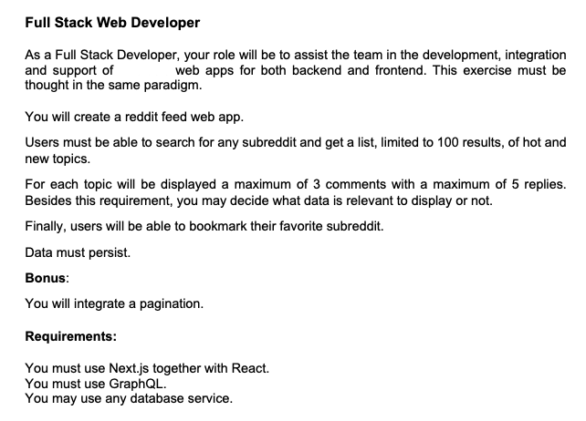

# test-next-graphql

Subject : 



See a demo on [test-react.boissard.info](http://test-react.boissard.info)

## Launch in development mode

### The react client :
This first one will start a server on port 3000 for the client app
```
cd app
npm install
npm run dev
```

### The graphql server :
This second one will start a server on port 4000 for the API app
```
cd api
npm install
npm start
```

## Deploy in production mode

### The react client :
```
cd app
npm install
npm build
```